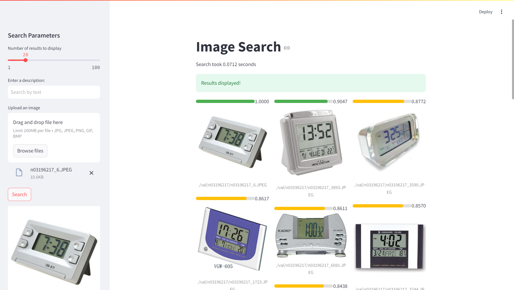
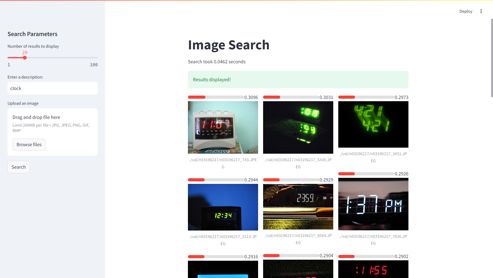

# Image Search

<video width="640" height="360" controls> <source src="./assets/demo.webm" type="video/webm"> Demo </video>

## Overview
This is a simple image search application built using [Clip](https://github.com/openai/CLIP/blob/main/README.md) and [Milvus](https://github.com/milvus-io/milvus). 
The application allows users to search for images based on their descriptions or an image and retrieve similar images from a dataset.

## Usage

1. Clone the repository.
2. Install the dependencies:
```bash
pip install -r requirements.txt
```
3. [Just the first time] Build the vector database by your images:
Put your images in `./photos` or where ever you want. (you can change the path in `build_database.py` and `app.py`) Then run:
```bash
python build_database.py
```
This may take a while based on the number of images.

4. Run the application:
```bash
streamlit run app.py  --server.port 8000
```

Then you can access the application at http://localhost:8000.
The application has two main functionalities:
1. Search by image: Upload an image and get similar images from the database.

2. Search by description: Enter a description and get similar images from the database.


## License
This project is licensed under the Apache 2.0 License.